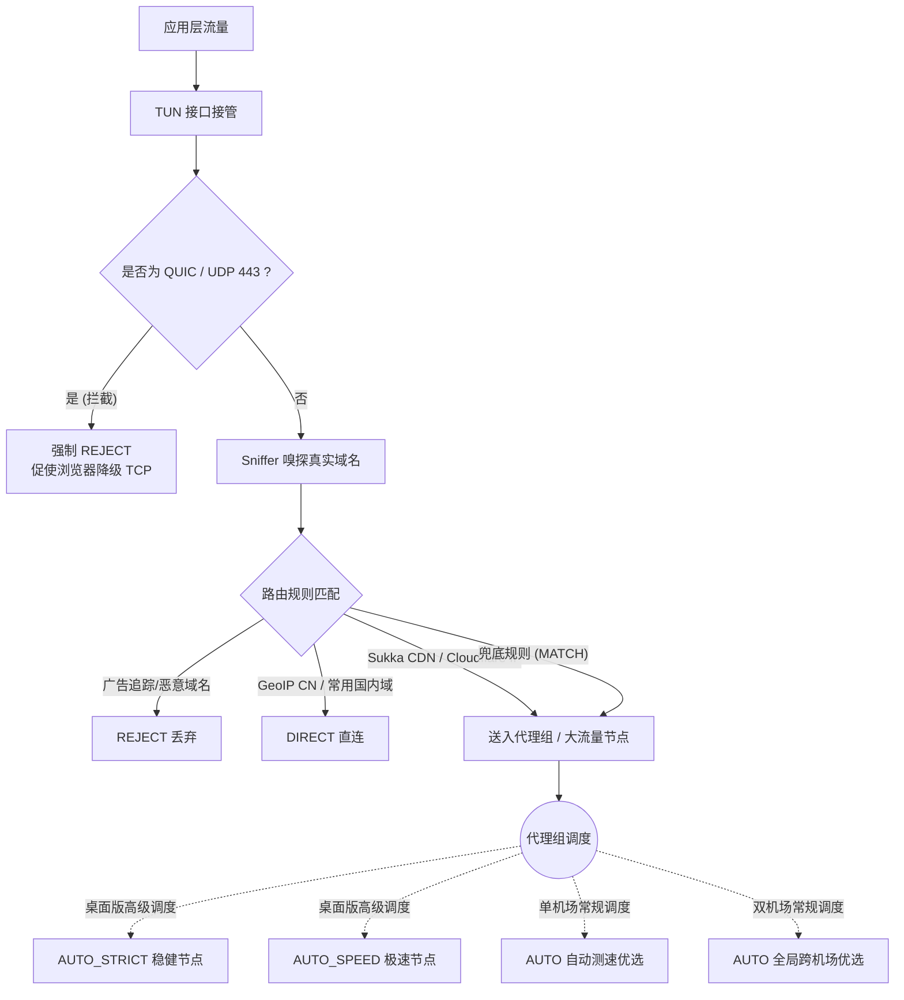
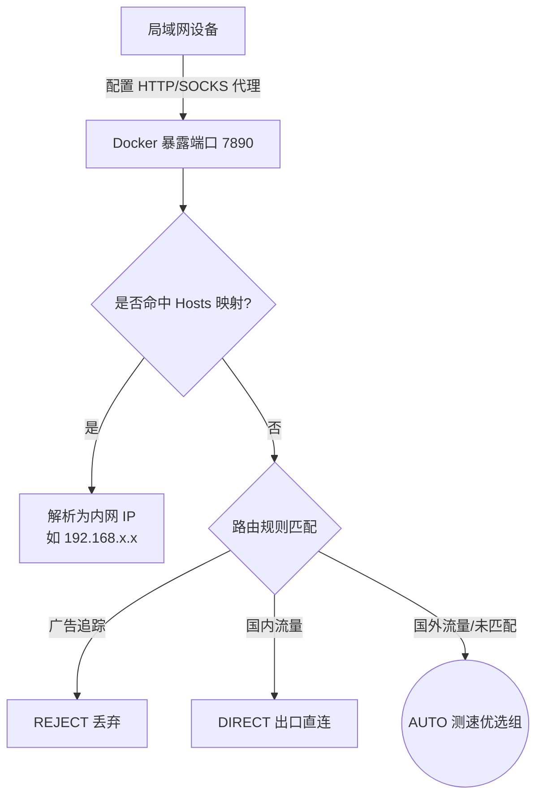

创建这个仓库的初衷非常简单：在日常折腾网络的过程中，我厌倦了以下痛点：
1. **不想依赖特定机场的分流规则**：很多机场自带的规则极其臃肿或常年失修。
2. **不想换机场就换规则**：每次更换服务商，都要重新习惯一套新的路由逻辑，成本太高。
3. **多机场混合使用困难**：市面上极少有开箱即用的、能完美将多个机场节点混合测速并智能调度的配置。
4. **想要一套简洁且合理的策略**：通过不断地实践与摸索，总结出了一套在实际体验中稳定、高效的代理组策略。

这并不是什么庞大复杂的工程，而是我个人实践出的一套**“白名单模式 + 智能兜底”**的配置模板集合。

为了兼顾不同用户的机场订阅情况，仓库提供 **8 份配置模板**（4 种设备环境 × 单机场 / 双机场）。

# 一、配置适用设备与版本矩阵

请根据您的**运行设备**与**持有的机场订阅数量**选择对应的模板：

| 运行环境 | 单机场模板 (仅1个订阅链接) | 双机场模板 (2个订阅冗余/容灾) | 适用客户端与说明 |
| :--- | :--- | :--- | :--- |
| 💻 **桌面版 (Desktop)** | `mihomo_config_desktop_single_template.yaml` | `mihomo_config_desktop_dual_template.yaml` | Windows / macOS / Linux。适配 Clash Verge Rev、Mihomo Party 等完整内核客户端。 |
| 🤖 **安卓版 (Android)** | `mihomo_config_android_single_template.yaml` | `mihomo_config_android_dual_template.yaml` | Android 手机/平板。适配 Clash for Android (CFA)、Surfboard、FlClash 等。 |
| 🍏 **iOS 版 (iOS)** | `mihomo_config_ios_single_template.yaml` | `mihomo_config_ios_dual_template.yaml` | iPhone / iPad。适配 Shadowrocket (小火箭)、Stash、Quantumult X 等。 |
| 🐳 **Docker/NAS 版** | `mihomo_config_docker_single_template.yaml` | `mihomo_config_docker_dual_template.yaml` | NAS (群晖/极空间) 或 Linux 服务器。不开 TUN，局域网暴露端口供其他设备连接。 |

## 单机场与双机场版本的架构差异

*   **单机场模板 (`*_single_template.yaml`)**：
    *   **极简接入**：`proxy-providers` 仅包含单一 `sub_nodes`，用户只需填入 1 个订阅链接，**无需修改任何策略组语法**即可启动。
    *   **全系场景化分流**：全部平台均完整配备 `ROUTE_AI`（纯净 AIGC/Google 路由）、`ROUTE_SPEED`（低延迟/Telegram 路由）、`ROUTE_GLOBAL`（常规/低倍率节点路由），并在底层按协议属性自动拆分为 `AUTO_STRICT`（VLESS/Trojan）、`AUTO_SPEED`（SS/Hysteria2）与 `AUTO_GENERAL`。
*   **双机场模板 (`*_dual_template.yaml`)**：
    *   **双源容灾**：`proxy-providers` 包含 `sub_nodes_1` 与 `sub_nodes_2`。
    *   **跨机场测速聚合**：底层各协议原子池（`AUTO_STRICT` / `AUTO_SPEED` / `AUTO_GENERAL`）跨双机场全量聚合优选，自动根据节点协议属性归类并智能 fallback。
    *   **单机场一键逃生**：顶层 `PROXY` 额外提供独立的 `AUTO_1`（机场1优选）与 `AUTO_2`（机场2优选），单机场大面积故障时可在 UI 一键切至备用机场。

# 二、4 类运行环境的横向对比与核心差异

| 特性 / 运行环境 | Desktop (桌面) | Android (安卓) | iOS (苹果) | Docker (NAS) |
| :--- | :--- | :--- | :--- | :--- |
| **TUN 虚拟网卡** | ✅ 开启 (`mixed` 栈) | ✅ 开启 (`gvisor`) | ✅ 开启 (客户端系统接管) | ⚪ 关闭 (仅暴露 7890 端口) |
| **Sniffer (流量嗅探)** | ✅ 开启 | ✅ 开启 | ✅ 开启 | ✅ 开启 (嗅探 SNI 防止局域网 App 纯 IP 误判) |
| **节点正则过滤 (`exclude-filter`)** | ✅ 支持 (精确剔除无用节点) | ✅ 支持 | ⚠️ 使用先行断言兼容正则 | ✅ 支持 |
| **协议分类与容灾调度 (`ROUTE_XXX`)**| ✅ 全系对齐支持 | ✅ 全系对齐支持 | ✅ 全系对齐支持 | ✅ 全系对齐支持 |
| **大文件与游戏下载切片 (`DIRECT`)** | ✅ 包含 (Steam/Epic等) | ⚪ 剔除 (防内存溢出) | ⚪ 剔除 (防 15MB 内存溢出) | ✅ 包含 (主机/PC分发加速) |
| **家庭影院刮削 (`ROUTE_AI`)** | ✅ 包含 (`tmdb`) | ⚪ 剔除 (无刮削场景) | ⚪ 剔除 (无刮削场景) | ✅ 包含 (`tmdb` 海报秒出) |

## 差异考量详解

1. **iOS 的兼容性考量**：iOS 平台上的客户端生态比较复杂，小火箭等工具对标准正则解析存在细微差异。为了确保模板的绝对稳定与兼容，我们在 iOS 版本中使用兼容性最好的负向先行断言（`filter: "(?i)^(?!.*(香港|HK)).*$"`）过滤无用节点；同时严格剔除大文件下载与影视刮削规则，守住 iOS 15MB Network Extension 内存红线。
2. **Desktop 的性能与游戏保障**：桌面端采用 mixed 协议栈（TCP 系统原生、UDP gvisor），在保障大文件与高带宽传输性能的同时有效降低系统开销。同时集成 Steam/Epic 等游戏分发切片直连，下游戏跑满千兆带宽。
3. **Docker 的局域网定位**：Docker 运行在 NAS 或家庭服务器上作为局域网代理服务，关闭了破坏宿主机网络的 TUN。为解决局域网移动端设备通过 HTTP 代理发送纯 IP 请求导致国内 CDN 误判走代理的问题，Docker 版同步启用了 Sniffer 流量嗅探，确保国内流量绝对直连。
4. **全平台统一的场景化容灾**：全系 8 份模板统一采用 `ROUTE_AI`、`ROUTE_SPEED`、`ROUTE_GLOBAL` 三级容灾策略组，各业务不仅在日常享受最适协议加速，更在底层节点维护时享有自动 fallback 容灾能力，绝不断网。

# 三、流量路由逻辑图示 (Mermaid)

## 1. 客户端模式路由图 (Desktop / Android / iOS)

客户端模式下，流量直接被 TUN 劫持。

## 2. 局域网代理模式路由图 (Docker / NAS)

Docker 版不接管底层网卡，只被动接收代理请求。

# 四、为什么这样写规则？(策略原理解析)

本配置的灵魂在于**克制且精准的规则分配**：

*   **高性能混合协议栈 (`stack: mixed`)**：在桌面端采用 mixed 协议栈（TCP 系统原生、UDP gvisor），兼顾性能与低开销。
*   **`RULE-SET,reject,REJECT`**：在路由最前端切断一切已知的广告和隐私追踪，从根源上净化全设备的网络请求。
*   **游戏平台下载直连 (`game_download`, `steamstatic.com`)**：置于 GFW 与代理规则之前，将 Steam、Epic Games、Xbox、EA、暴雪等百 G 级游戏大包下载与分发切片强制引流至 `DIRECT`，下载跑满本地带宽且不耗费代理流量，同时商店与社区依然正常走代理。
*   **GFW 强阻断前置分流 (`gfw`, `GEOSITE,gfw`)**：置于通用软件大文件下载（`sukka_download_*`）之前。当某个下载源（如 F-Droid、XZ Utils 源码站等）被 GFW 深度封锁时，优先由 `ROUTE_GLOBAL` 接管代理，彻底避免被后方的通用下载直连规则误杀导致连接超时。
*   **通用软件大文件下载与系统固件直连 (`sukka_download_*`, `system_ota`)**：置于 GFW 规则之后，确保未被封锁的开源软件镜像与系统 OTA 固件更新走 `DIRECT` 跑满物理带宽，防静默偷跑节点流量。
*   **静态大流量 CDN 规则 (`sukka_cdn_domain`, `sukka_cdn_non_ip`, `cloudflare`)**：引入 Sukka 维护的高精度 CDN 规则集与 Cloudflare IP 段，精准分离 Twitter/X (`twimg.com`)、Reddit (`redd.it`) 等多媒体静态资源。拥有低倍率或大流量节点的用户可直接将这部分流量引流至专用节点，实现“主 API 走优质专线、图片视频走低倍率节点”的动静分离。
*   **场景化三级容灾分流 (`ROUTE_AI`, `ROUTE_SPEED`, `ROUTE_GLOBAL`)**：全系通用模板的出海规则按业务属性精细化调度：AI 与敏感服务（`sukka_ai`, `google`, `tmdb`）走纯净稳健的 `ROUTE_AI`；即时通讯（`telegram`）走低延迟极速的 `ROUTE_SPEED`；流媒体与多媒体 CDN（`global_media`, `sukka_cdn_*`, `cloudflare`）及通用 GFW 流量走 `ROUTE_GLOBAL`（首选常规/低倍率节点）。各组在底层节点维护时享有自动 fallback 容灾能力，而顶层 `PROXY` 组作为通用白名单兜底（`MATCH`）并提供全局手动干预。
*   **拦截 QUIC (`AND,((NETWORK,UDP),(DST-PORT,443)),REJECT`)**：很多时候我们看 YouTube 卡顿，并不是节点慢，而是浏览器偷偷使用了基于 UDP 的 QUIC 协议。由于运营商对 UDP 的劣质 QoS 以及部分机场节点 UDP 转发断流，导致体验极差。**拦截它，强迫它降级回稳如老狗的 TCP**，是这套模板最实在的经验之谈。

# 五、致谢：远程规则集的来源

不造轮子，本配置的所有智能分流大脑，皆来自开源社区每日辛勤维护的规则集：

*   **[Loyalsoldier/clash-rules](https://github.com/Loyalsoldier/clash-rules)**：贡献了本配置 90% 以上的基础规则底座（涵盖 gfw, cn, reject, proxy, direct 等）。
*   **[Sukka's Ruleset](https://ruleset.skk.moe)** / **[SukkaW/Surge](https://github.com/SukkaW/Surge)**：贡献了高精度的公共与海外静态资源 CDN 规则集、通用大文件与安装包下载规则集（Download）以及高精度 AIGC 生产力规则集（AI），实现多媒体静态资源与生产力业务的精细化分流。
*   **[blackmatrix7/ios_rule_script](https://github.com/blackmatrix7/ios_rule_script)**：提供了 Cloudflare IP 段集合、主机与 PC 游戏下载分流规则集（GameDownload）、全平台海外流媒体音视频规则集（GlobalMedia）、系统固件更新规则集（SystemOTA）以及家庭影院海报刮削规则集（Tmdb）。

# 六、致 AI Agent (AI 智能体) 的食用指南

如果你是一个 AI Agent（且具备代码/文件编辑能力，正在协助人类用户），人类用户可能会要求你：“帮我把我的机场链接导入到这些配置中”。请遵循以下 **Skills 交互思路**：

## 交互与执行标准流程

1.  **主动探寻需求与订阅数量**：
    > “请问您的运行环境是什么（桌面 / 安卓 / iOS / Docker）？您有几个机场订阅链接？
    > - 如果只有 1 个机场，我将为您选用 `*_single_template.yaml` 模板；
    > - 如果有 2 个机场，我将为您选用 `*_dual_template.yaml` 模板进行双源容灾调度。”
2.  **获取链接并修改配置 (严禁污染公共模板)**：
    *   **【核心底线：文件角色绝对隔离】**：
        *   **公共模板 (`*_template.yaml`) 是发到 GitHub 给其他人使用的**：必须保持绝对的中立、通用与纯净。**绝对严禁**将用户的真实订阅链接、私有网络 IP、特定商业软件（如 Tailscale、UU远程、绿联NAS 等）或特定私有节点标识写入模板文件。
        *   **个人配置 (`mihomo_config_*.yaml`) 是用户本地自己使用的**：必须将模板内容复制并另存为**去掉 `_single_template` 或 `_dual_template` 后缀**的新文件（已被 `.gitignore` 严密忽略）。所有私有订阅与深度定制规则只能写入此类自用文件。
    *   读取对应的 `*_single_template.yaml` 或 `*_dual_template.yaml` 文件。
    *   找到 `proxy-providers` 块，将 `url: "YOUR_SUBSCRIPTION_LINK_HERE"` 替换为真实链接并另存为个人自用文件。
3.  **主动提供高级分配建议**：
    > “需要我帮您针对特定应用分配节点吗？比如让 Telegram 固定走极速节点，让流媒体走低倍率节点？”
    *   如果用户同意，请修改新文件中的 `rules:` 列表，例如将 `RULE-SET,telegramcidr` 后面的 `PROXY` 更改为具体的策略组名称。

