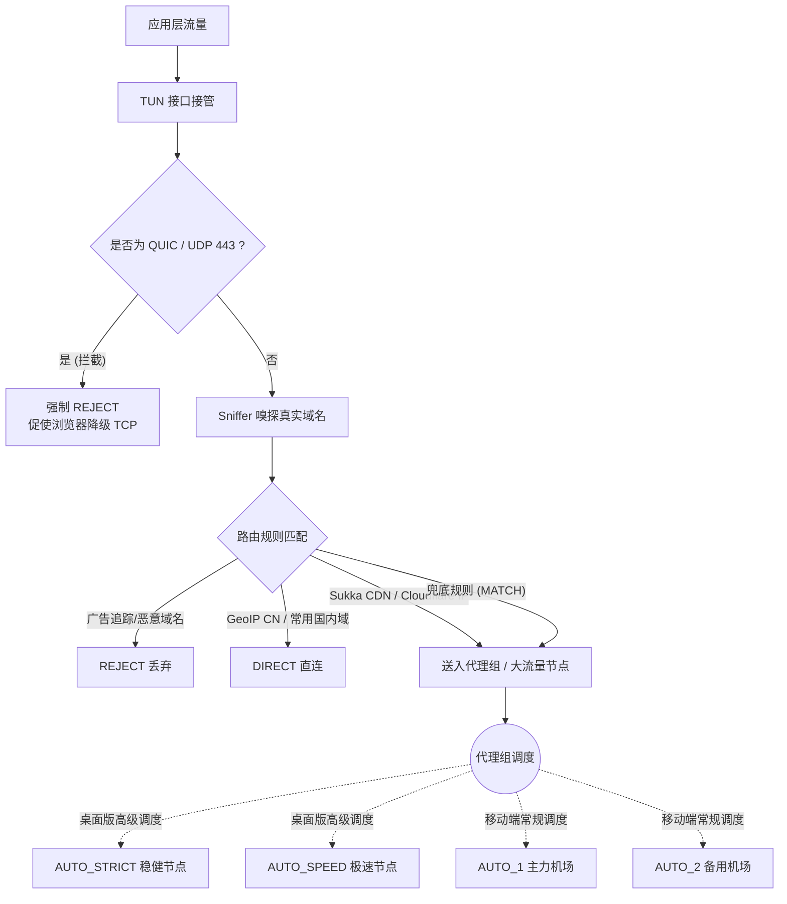
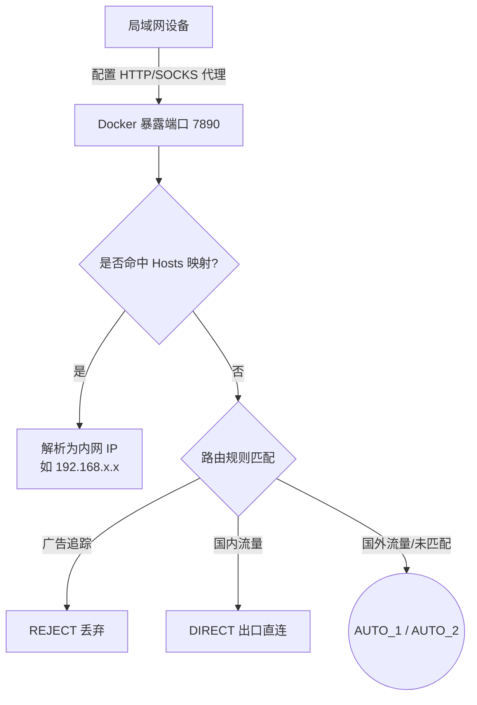

创建这个仓库的初衷非常简单：在日常折腾网络的过程中，我厌倦了以下痛点：
1. **不想依赖特定机场的分流规则**：很多机场自带的规则极其臃肿或常年失修。
2. **不想换机场就换规则**：每次更换服务商，都要重新习惯一套新的路由逻辑，成本太高。
3. **多机场混合使用困难**：市面上极少有开箱即用的、能完美将多个机场节点混合测速并智能调度的配置。
4. **想要一套简洁且合理的策略**：通过不断地实践与摸索，总结出了一套在实际体验中稳定、高效的代理组策略。

这并不是什么庞大复杂的工程，而是我个人实践出的一套**“白名单模式 + 智能兜底”**的配置模板集合。

# 一、配置适用设备概览

在深入探讨区别之前，请先对号入座，这 4 份配置文件分别针对以下运行环境：

*   💻 **`mihomo_config_desktop_template.yaml` (桌面版)**
    *   **适用设备**：Windows / macOS / Linux 电脑。
    *   **适用客户端**：Clash Verge Rev、Mihomo Party 等完整支持 Mihomo 内核特性的桌面客户端。
*   🤖 **`mihomo_config_android_template.yaml` (安卓版)**
    *   **适用设备**：Android 手机 / 平板。
    *   **适用客户端**：Clash for Android (CFA)、Surfboard、FlClash 等。
*   🍏 **`mihomo_config_ios_template.yaml` (iOS 版)**
    *   **适用设备**：iPhone / iPad。
    *   **适用客户端**：Shadowrocket (小火箭)、Stash、Quantumult X 等（支持 Clash 格式订阅的工具）。
*   🐳 **`mihomo_config_docker_template.yaml` (Docker/NAS 版)**
    *   **适用设备**：NAS (如群晖、极空间)、家庭服务器。
    *   **运行模式说明**：明确一点，此配置**不开 TUN 模式，也不是传统意义上的旁路由网关**。它仅仅是通过 Docker 运行，并在局域网内暴露一个代理端口（如 `7890`）。局域网内的其他设备需要手动配置代理 IP 和端口来连入它。

# 二、4 份配置文件的横向对比与核心差异

为了适应不同平台的特性和客户端的性能限制，4 份配置在细节上有明确的区分考量：

| 特性 / 配置文件 | Desktop (桌面) | Android (安卓) | iOS (苹果) | Docker (NAS) |
| :--- | :--- | :--- | :--- | :--- |
| **TUN 虚拟网卡** | ✅ 开启 (`mixed` 栈，支持 Tailscale/私网排除) | ✅ 开启 | ✅ 开启 (客户端接管) | ⚪ 关闭 (仅暴露端口) |
| **Sniffer (流量嗅探)** | ✅ 开启 | ✅ 开启 | ✅ 开启 | ✅ 开启 |
| **节点正则过滤 (`exclude-filter`)** | ✅ 支持 (精确剔除无用节点) | ✅ 支持 | ⚠️ 视客户端而定 | ✅ 支持 |
| **协议类型过滤 (`exclude-type`)** | ✅ 支持 (按需筛选协议) | ⚪ 未使用 (可按需添加) | ⚠️ 视客户端而定 | ⚪ 未使用 (可按需添加) |
| **私有内网 Hosts 解析** | ⚪ 无需 | ⚪ 无需 | ⚪ 无需 | ✅ 配置了 `hosts:` (供局域网解析) |
| **代理组策略复杂度** | 高 (`AUTO_STRICT`, `SPEED` 等) | 中 (`AUTO_1`, `AUTO_2`) | 低 (`AUTO_1`, `AUTO_2`) | 中 (`AUTO_1`, `AUTO_2`) |

## 差异考量详解

1. **iOS 的兼容性考量**：iOS 平台上的客户端生态比较复杂，哪怕是基于 Clash 内核的工具（如 Stash），在实际测试中对 `exclude-filter`（正则）和 `exclude-type` 等高级语法的解析也偶有兼容性问题或未完全适配；而普及率极高的 Shadowrocket（小火箭）更是由于采用自研解析器，对这些语法支持不佳。为了确保模板的绝对稳定与兼容，我们在 iOS 版本中果断舍弃了这些高级过滤，退回最稳健的基础策略组模式。当然，如果未来您的客户端对此更新了完美支持，您可以参考 Desktop 的写法自行将规则加回来。
2. **Desktop 的火力全开与异地组网共存**：桌面端性能充裕且客户端支持完整。我们利用 `exclude-type` 剥离出稳定性要求极高的协议放进 `AUTO_STRICT`（如 Vless/Trojan），把追求速度的协议放进 `AUTO_SPEED`，实现精细化的分层调度。同时，桌面端完整配置了 `route-exclude-address`、`fake-ip-filter` 与多平台进程直连规则，开箱即用支持与 Tailscale 等虚拟组网工具在 TUN 模式下无缝共存，兼顾 P2P 打洞穿透与 NAS 极速访问。
3. **Docker 的局域网定位**：既然它在内网做代理服务器，就需要解决内网域名的解析问题。因此只有它启用了 `hosts:` 字段映射（例如 `your-private-domain.com: 192.168.x.x`），并且关闭了破坏宿主机网络的 TUN。

# 三、流量路由逻辑图示 (Mermaid)

## 1. Desktop / Android / iOS (客户端模式路由图)

客户端模式下，流量直接被 TUN 劫持。

## 2. Docker (局域网代理模式路由图)

Docker 版不接管底层网卡，只被动接收代理请求。

# 四、为什么这样写规则？(策略原理解析)

本配置的灵魂在于**克制且精准的规则分配**：

*   **Tailscale / 异地组网完美共存与打洞优化**：
    *   **TUN 路由层精准排除 (`route-exclude-address`)**：将 Tailscale 专用网段（IPv4 `100.64.0.0/10` 与 IPv6 `fd7a:115c:a1e0::/48`）直接从 TUN 虚拟网卡路由中剔除。避免了仅依赖 DIRECT 规则时流量被 TUN 劫持后物理网卡无法完成跨网段寻址导致的断连超时问题。
    *   **Fake-IP 免疫过滤 (`fake-ip-filter`)**：将 `*.ts.net`、`*.tailscale.com`、`controlplane.tailscale.com` 与 `log.tailscale.io` 纳入直连解析名单，杜绝 MagicDNS 与控制平面的假 IP 污染，消除反复掉线与“NeedsLogin”异常。
    *   **全平台进程与流量直连**：显式放行 Windows（`tailscaled.exe`、`tailscale-ipn.exe`）及 macOS（`Tailscale`、系统扩展版、App Store 版）的客户端与服务进程，确保 STUN 穿透探测包不经节点转发，保护点对点（P2P）打洞成功率，避免降级至 DERP 中继。
    *   **高性能混合协议栈 (`stack: mixed`)**：在 TUN 模式下采用 mixed 协议栈（TCP 系统原生、UDP gvisor），在保障大文件与局域网高带宽传输性能的同时有效降低系统开销。
*   **`RULE-SET,reject,REJECT`**：在路由最前端切断一切已知的广告和隐私追踪，从根源上净化全设备的网络请求。
*   **国内直连提权 (`direct`, `cncidr`, `GEOSITE,CN`, `GEOIP,CN`)**：置于 CDN 规则之前，确保所有国内日常访问（包括使用部分多线 CDN 的国内网站）绝对优先走 `DIRECT`，防止被后续海外 CDN 规则误判。
*   **静态大流量 CDN 规则 (`sukka_cdn_domain`, `sukka_cdn_non_ip`, `cloudflare`)**：引入 Sukka 维护的高精度 CDN 规则集与 Cloudflare IP 段，精准分离 Twitter/X (`twimg.com`)、Reddit (`redd.it`) 等多媒体静态资源。拥有低倍率或大流量节点的用户可直接将这部分流量引流至专用节点，实现“主 API 走优质专线、图片视频走低倍率节点”的动静分离。
*   **拦截 QUIC (`AND,((NETWORK,UDP),(DST-PORT,443)),REJECT`)**：很多时候我们看 YouTube 卡顿，并不是节点慢，而是浏览器偷偷使用了基于 UDP 的 QUIC 协议。由于运营商对 UDP 的劣质 QoS 以及部分机场节点 UDP 转发断流，导致体验极差。**拦截它，强迫它降级回稳如老狗的 TCP**，是这套模板最实在的经验之谈。

# 五、致谢：远程规则集的来源

不造轮子，本配置的所有智能分流大脑，皆来自开源社区每日辛勤维护的规则集：

*   **[Loyalsoldier/clash-rules](https://github.com/Loyalsoldier/clash-rules)**：贡献了本配置 90% 以上的基础规则（涵盖 gfw, cn, reject, proxy, direct 等）。
*   **[Sukka's Ruleset](https://ruleset.skk.moe)** / **[SukkaW/Surge](https://github.com/SukkaW/Surge)**：贡献了高精度的公共与海外静态资源 CDN 规则集，实现图片与音视频等大流量媒体与 API 的动静分离。
*   **[blackmatrix7/ios_rule_script](https://github.com/blackmatrix7/ios_rule_script)**：提供了 Cloudflare 的精准 IP 段集合，解决了 CDN 绕过问题。

# 六、致 AI Agent (AI 智能体) 的食用指南

如果你是一个 AI Agent（且具备代码/文件编辑能力，正在协助人类用户），人类用户可能会要求你：“帮我把我的机场链接导入到这些配置中”。请遵循以下 **Skills 交互思路**：

## 交互与执行标准流程

1.  **主动探寻需求**：
    > “请问您有几个机场订阅链接需要导入？我可以帮您分别注入到 `sub_nodes_1` 和 `sub_nodes_2` 中。”
2.  **获取链接并修改配置 (严禁覆盖模板)**：
    *   读取对应的 `*_template.yaml` 文件。
    *   找到 `proxy-providers` 块，将 `url: "YOUR_SUBSCRIPTION_LINK_HERE"` 替换为真实链接。
    *   如果用户只有一个机场，可将 `sub_nodes_2` 删除或注释掉。
    *   **【关键】**：必须将修改后的内容另存为**去掉 `_template` 后缀**的新文件（例如保存为 `mihomo_config_ios.yaml`），绝对不可以破坏原有的模板文件。
3.  **主动提供高级分配建议**：
    > “需要我帮您针对特定应用分配节点吗？比如让 Telegram 固定走 `AUTO_1`，让流媒体固定走 `AUTO_2`？”
    *   如果用户同意，请修改新文件中的 `rules:` 列表，例如将 `RULE-SET,telegramcidr` 后面的 `PROXY` 更改为具体的策略组名称。