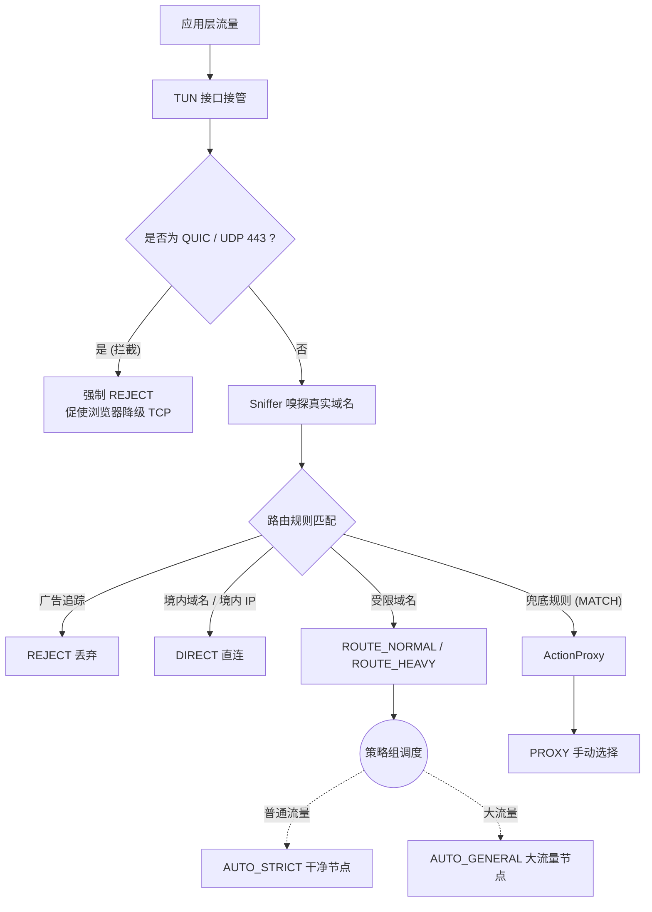
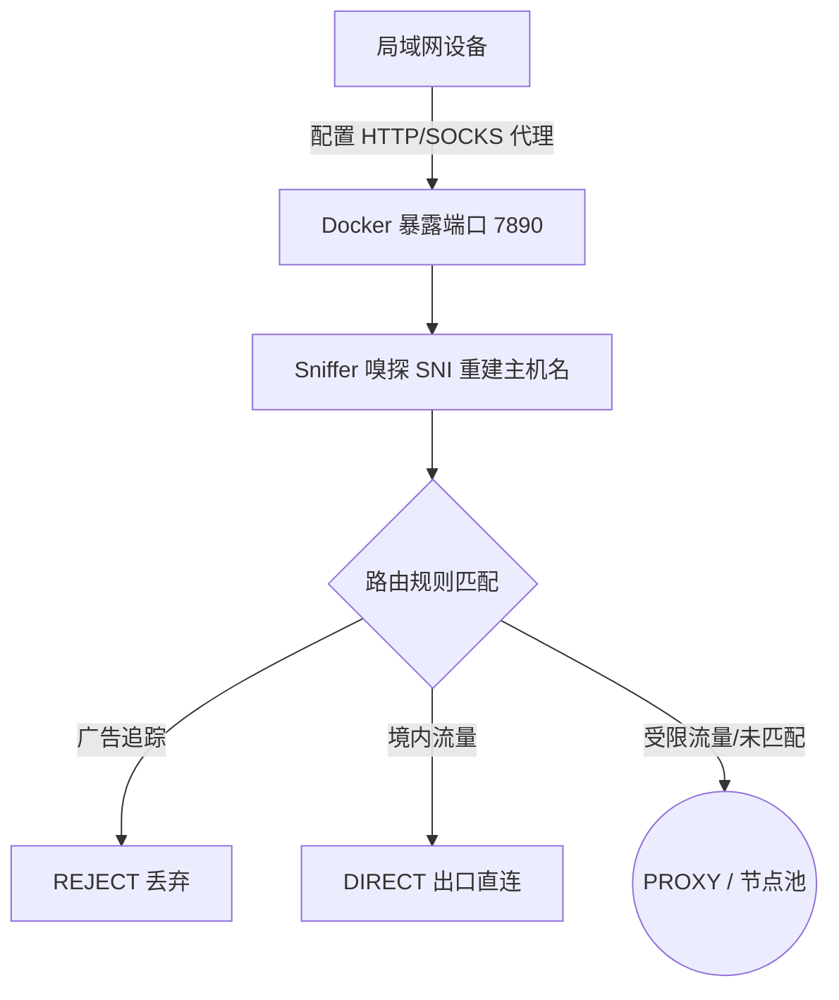

创建这个仓库的初衷非常简单：在日常折腾网络的过程中，我厌倦了以下痛点：

1. **不想依赖特定机场的分流规则**：很多机场自带的规则极其臃肿或常年失修。
2. **不想换机场就换规则**：每次更换服务商，都要重新习惯一套新的路由逻辑，成本太高。
3. **多机场混合使用困难**：市面上极少有开箱即用的、能完美将多个机场节点混合测速并智能调度的配置。
4. **想要一套简洁且合理的策略**：通过不断地实践与摸索，总结出了一套在实际体验中稳定、高效的代理组策略。

这并不是什么庞大复杂的工程，而是我个人实践出的一套**「白名单模式 + 智能兜底」**的配置模板集合。

为兼顾不同用户的机场订阅情况，仓库提供 **8 份配置模板**（4 种设备环境 × 单机场 / 双机场）。

# 一、配置适用设备与版本矩阵

请根据**运行设备**与**持有的机场订阅数量**选择对应模板：

| 运行环境 | 单机场模板（1 个订阅链接） | 双机场模板（2 个订阅冗余/容灾） | 适用客户端与说明 |
| :--- | :--- | :--- | :--- |
| 💻 **桌面版 (Desktop)** | `mihomo_config_desktop_single_template.yaml` | `mihomo_config_desktop_dual_template.yaml` | Windows / macOS / Linux。适配 Clash Verge Rev、Mihomo Party 等完整内核客户端。 |
| 🤖 **安卓版 (Android)** | `mihomo_config_android_single_template.yaml` | `mihomo_config_android_dual_template.yaml` | Android 手机/平板。适配 Clash for Android、Surfboard、FlClash 等。 |
| 🍏 **iOS 版 (iOS)** | `mihomo_config_ios_single_template.yaml` | `mihomo_config_ios_dual_template.yaml` | iPhone / iPad。**iOS 上没有成熟的 Mihomo 客户端，实际普遍用 Stash 或 Shadowrocket；本仓库按 Stash 适配**，详见下文第六节。 |
| 🐳 **Docker/NAS 版** | `mihomo_config_docker_single_template.yaml` | `mihomo_config_docker_dual_template.yaml` | NAS（群晖/极空间）或 Linux 服务器。不开 TUN，局域网暴露端口供其他设备连接。 |

## 单机场与双机场版本的架构差异

*   **单机场模板（`*_single_template.yaml`）**：
    *   **极简接入**：`proxy-providers` 仅含单一 `sub_nodes`，填入 1 个订阅链接即可启动，无需改策略组语法。
    *   **两个组各司其职**：`AUTO` 是自动选优的节点池，业务规则直接指向它；`PROXY` 是手动逃生口兼最终兜底。
*   **双机场模板（`*_dual_template.yaml`）**：
    *   **双源容灾**：`proxy-providers` 含 `sub_nodes_1` 与 `sub_nodes_2`。
    *   **跨机场测速聚合**：`AUTO` 跨双机场全量聚合优选。
    *   **单机场一键逃生**：顶层 `PROXY` 额外提供独立的 `AUTO_1`（机场1优选）与 `AUTO_2`（机场2优选），单机场大面积故障时可在 UI 一键切至备用机场。

# 二、4 类运行环境的横向对比与核心差异

| 特性 / 运行环境 | Desktop（桌面） | Android（安卓） | iOS（苹果） | Docker（NAS） |
| :--- | :--- | :--- | :--- | :--- |
| **TUN 虚拟网卡** | ✅ 开启（`mixed` 栈） | ✅ 开启（`gvisor`） | ⚪ 由 Stash 的 VPN profile 接管 | ⚪ 关闭（仅暴露 7890 端口） |
| **Sniffer（流量嗅探）** | ✅ 开启 | ✅ 开启 | ⚪ 不使用，Stash 自行识别 | ✅ 开启（嗅探 SNI 防局域网 App 纯 IP 误判） |
| **规则集格式** | `.mrs`（Mihomo 编译格式） | `.mrs` | **`.yaml` payload**（Stash 不认 `.mrs`） | `.mrs` |
| **QUIC 阻断（`AND,…` 逻辑规则）** | ✅ 启用 | ✅ 启用 | ⚠️ 注释保留，待实测 | ✅ 启用 |
| **游戏下载直连** | ✅ 包含 | ⚪ 剔除 | ⚪ 剔除 | ✅ 包含 |
| **Windows 更新直连（`win_update`）** | ✅ 包含 | ⚪ 剔除 | ⚪ 剔除 | ✅ 包含 |
| **CDN 边缘 IP 层（1033 条 CIDR）** | ✅ 包含 | ✅ 包含 | ⚪ 剔除（守 15MB 内存红线） | ✅ 包含 |
| **节点正则过滤** | ✅ 支持 | ✅ 支持 | ✅ 负向先行断言（兼容 iOS 正则） | ✅ 支持 |
| **外部管理接口** | `127.0.0.1:9090` | 不启用 | 不启用 | `0.0.0.0:9090`（供局域网面板） |

各平台差异只动平台设置与资源裁剪，**分流判定链四平台一致**。

Docker 的管理接口不设 CORS 白名单——白名单会挡住自建面板（如 NAS 上的 metacubexd），面板会报「检测不到后端」而后端其实正常（API 返回 200）。代价是任何网页都能调用该 API，且当前未设 `secret`，局域网内设备可直接改路由；需要鉴权请填入配置中注释掉的 `secret: YOUR_CONTROLLER_SECRET`。

**如果你需要限制来源**，可自行在配置里加回 `external-controller-cors`，并把你面板的实际地址写进 `allow-origins`（多个就列多行）：

```yaml
external-controller-cors:
  allow-private-network: true
  allow-origins:
    - https://yacd.metacubex.one
    - http://192.168.1.100:8080   # 换成你面板的真实地址
```

注意两点：一是白名单**只认确切的协议+主机+端口**，`http` 与 `https`、端口号不同都算不同源；二是加了之后若面板连不上，先按上面说的确认后端本身是否 200——多数「检测不到后端」其实是白名单漏了自己的面板地址，而非后端故障。

## 差异考量详解

1. **iOS 按 Stash 适配**：iOS 平台客户端生态复杂，Stash 的规则集格式是 `payload:` YAML 而非 Mihomo 专有 `.mrs`，故三份 iOS 配置的 provider URL 全部换用 `.yaml`（同一 `meta` 发布分支、同源数据）。同时去掉 `sniffer` 与 `tun` 块、把 QUIC 逻辑规则注释保留（`AND,…` 是否被 Stash 支持未证实）。节点过滤改用负向先行断言，与查官方文档得到的写法一致。
2. **移动端内存壁垒**：iOS Network Extension 有 15MB Jetsam 内存红线，规则膨胀会触发后台静默崩溃。手机端不存在主机游戏下载等重型场景，故移动端统一剔除 `game_download`、`epic_platform`、`win_update`，iOS 另剔除 CDN IP 层。
3. **Desktop 的性能与游戏保障**：桌面端采用 mixed 协议栈（TCP 系统原生、UDP gvisor），保障大文件高带宽传输同时降低系统开销；集成游戏分发切片直连，下载跑满本地带宽且不耗代理流量。
4. **Docker 的局域网定位**：Docker 运行在 NAS 或家庭服务器，关闭了破坏宿主机网络的 TUN。为解决局域网设备发纯 IP 请求导致国内 CDN 误判走代理的问题，同步启用 Sniffer 嗅探重建主机名，`override-destination` 设为 `true`。
5. **明确不做的裁剪**：不引入测速规则（用户无测速习惯，只增加维护开销与内存占用）、不引入 PT Tracker 拦截（NAS 本身不做种，且真要做种的设备也不经过本代理）。

# 三、分流判定链

四平台一致，自上而下**首匹配**：

1. **应当拦截吗？是 → `REJECT`**（广告/追踪）
2. **需翻墙？否 → `DIRECT`**。**不应翻墙的绝不翻墙。**
3. **需翻墙 + 普通流量 → `ROUTE_NORMAL`**（交互型、非大流量）
4. **需翻墙 + 大流量 → `ROUTE_HEAVY`**（持续大载荷）
5. 其余 → `MATCH,PROXY` 兜底

准入判据是**同质性**：同质性不通过的一律不进。`DIRECT`↔`ROUTE_*` 搞错是**硬故障**，门槛严格；`ROUTE_NORMAL`↔`ROUTE_HEAVY` 搞错是**软故障**，按宿主内容类型判，门槛放宽。

注意「规则集」是宽泛说法——实际取用的是 geo/geosite、geoip、categories 等各形态中**覆盖最全且同质**的那一个，不是只看规则集形态。

# 四、规则顺序（22 个规则资源）

```
 1. category_ads_all                  -> REJECT
 2. private_domain                    -> DIRECT
 3. private_ip                        -> DIRECT   (no-resolve)
 4. geo_cn_ip                         -> DIRECT   (no-resolve)
    ── 个人例外 -> DIRECT ──（仅个人配置，见设计文档）
 5. QUIC: UDP 且目标端口 443          -> REJECT
 6. gfw                               -> ROUTE_NORMAL
 7. cn                                -> DIRECT
 8. ai_chat                           -> ROUTE_NORMAL
 9. google                            -> ROUTE_NORMAL
10. media                             -> ROUTE_HEAVY
    social_media_nc                   -> ROUTE_HEAVY
    netdisk_nc                        -> ROUTE_HEAVY
11. game_download                     -> DIRECT
12. epic_platform                     -> DIRECT      （仅 Desktop / Docker）
13. apple / microsoft                 -> DIRECT
    win_update                        -> DIRECT      （仅 Desktop / Docker）
14. cdn_nc / cdn_akamai / cdn_fastly  -> ROUTE_HEAVY
    cdn_ip_{cloudflare,cloudfront,fastly} -> ROUTE_HEAVY (no-resolve)
15. MATCH,PROXY                       -> 兜底
```

规则顺序不是随手排的，几处关键取舍：

*   **`cn` 在 `gfw` 之后、大流量层之前**：`gfw` 有 22 条受限站点被 `cn` 覆盖（`futu.cn`、`longbridge.cn`、`google.cn`、`bloomberg.cn` 等），必须先由 `gfw` 捞走；而大流量层有 59 条境内服务被 `cn` 覆盖，必须先由 `cn` 直连。
*   **QUIC 阻断**：拦截 QUIC 强迫浏览器降级 TCP。很多时候看视频卡顿并不是节点慢，而是浏览器偷偷用了基于 UDP 的 QUIC——运营商对 UDP 的劣质 QoS 以及部分节点的 UDP 转发断流才是真凶。它在个人配置里排在个人例外之后，是为了不误杀依赖 UDP 打洞的内网组网流量（见设计文档）。
*   **游戏下载在 `gfw` 之后、CDN 之前**：集合里的共享 CDN 边缘主机需代理，让 `gfw` 先命中；而 CDN 集合会吞掉其 10 个成员，所以 CDN 层必须在其后。
*   **`win_update` 必须单列**：`microsoft` 只覆盖 `win-update` 的 358/364 条，余 6 条挂在共享 CDN 边缘域名下会被推去代理。移动端不引入。
*   **CDN 层在 `gfw` 之后**：代价是 6 个 CDN 边缘主机落 `ROUTE_NORMAL`，属已知软故障。

> **一处顺序无法解决的三方牵制**：`gfw`、`cn`、三层大流量集合构成环，任何线性排列都必须放弃一条。当前采用唯一「零打不开、零境内走代理」的排列，代价是 70 条大流量落 `ROUTE_NORMAL`。待实测后裁定。

# 五、策略组

| 组 | 类型 | 候选 | 出现于 | 含义 |
|---|---|---|---|---|
| `AUTO` | url-test | 全部节点，不区分 | 仅公开模板 | 节点池，自动选优。业务规则直接指向它 |
| `ROUTE_NORMAL` | fallback | 干净节点池 → 大流量节点池 → 末位逃生池 | 仅个人配置 | 普通流量：交互型、非大流量 |
| `ROUTE_HEAVY` | fallback | 大流量节点池 → 干净节点池 → 末位逃生池 | 仅个人配置 | 大流量：持续大载荷 |
| `AUTO_STRICT` | url-test | 第一份订阅，按节点名排除大流量节点 | 仅个人配置 | 干净/交互节点 |
| `AUTO_GENERAL` | url-test | 第一份订阅，按节点名只取大流量节点 | 仅个人配置 | 下载/视频/持续传输节点 |
| 末位逃生池 | url-test | 第二份订阅整体，不分池 | 仅个人配置 | 独立逃生入口，恒在链尾 |
| `AUTO_1` / `AUTO_2` | url-test | 各引用一份订阅 | 仅双机场公开模板 | 独立逃生入口 |
| `PROXY` | select | 节点池 + 逃生口 | 全部 | 手动逃生口与最终兜底 |

三个节点池**互斥**：第一份订阅的节点按节点名分进干净池与大流量池，第二份订阅的节点整体只进末位逃生池。逃生池因此是真正独立的，`ROUTE_*` 链的前两级走第一份订阅、兜不住才切第二份。具体节点名与订阅标识见设计文档。

**模板没有 ROUTE 层**：模板只有一个节点池，普通流量与大流量落到同一组，再包一层 `ROUTE_NORMAL` / `ROUTE_HEAVY` 只是纯转发。所以模板的业务规则直接指向 `AUTO`，两个组各司其职。个人配置才需要 `ROUTE_*`——那里是两个真实的池，两条链的首选顺序不同。

`AUTO_1` / `AUTO_2` 的切换入口按平台不同：Desktop 与 Docker 启用了 `external-controller`（Desktop 绑 `127.0.0.1:9090`、Docker 绑 `0.0.0.0:9090`），可用 yacd 之类的 Web 面板切换；iOS / Android 不启用控制器，由客户端 App 自带的策略组 UI 切换。

## 命名由来

早期配置把节点按适用场景分为纯净 / 普通 / 大流量三组，`ROUTE_AI` 最初只针对 AI 业务、`ROUTE_GLOBAL` 表达走全球节点；合并后语义与名字脱节，故更名为 `ROUTE_NORMAL` / `ROUTE_HEAVY`，直接编码判定链的分类轴。

# 六、路由逻辑图（Mermaid）

## 1. 客户端模式路由图（Desktop / Android / iOS）

客户端模式下，流量被 TUN 劫持。


```mermaid
graph TD
    App[应用层流量] --> TUN[TUN 接口接管]
    TUN --> QUIC{是否为 QUIC / UDP 443 ?}
    QUIC -- 是 (拦截) --> RejectQuic[强制 REJECT <br> 促使浏览器降级 TCP]
    QUIC -- 否 --> Sniff[Sniffer 嗅探真实域名]
    Sniff --> Match{路由规则匹配}

    Match -- 广告追踪 --> ActionReject[REJECT 丢弃]
    Match -- 境内域名 / 境内 IP --> ActionDirect[DIRECT 直连]
    Match -- 受限域名 --> ActionRoute[ROUTE_NORMAL / ROUTE_HEAVY]
    Match -- 兜底规则 (MATCH) --> ActionProxy

    ActionRoute --> Selector((策略组调度))
    Selector -. 普通流量 .-> Strict[AUTO_STRICT 干净节点]
    Selector -. 大流量 .-> General[AUTO_GENERAL 大流量节点]
    ActionProxy --> Manual[PROXY 手动选择]
```

## 2. 局域网代理模式路由图（Docker / NAS）

Docker 版不接管底层网卡，只被动接收代理请求。


```mermaid
graph TD
    LAN[局域网设备] -- 配置 HTTP/SOCKS 代理 --> Port[Docker 暴露端口 7890]
    Port --> Sniff[Sniffer 嗅探 SNI 重建主机名]

    Sniff --> Match{路由规则匹配}

    Match -- 广告追踪 --> ActionReject[REJECT 丢弃]
    Match -- 境内流量 --> ActionDirect[DIRECT 出口直连]
    Match -- 受限流量/未匹配 --> ActionProxy((PROXY / 节点池))
```

# 七、iOS 适配

iOS 目标客户端是 **Stash**，不是 Mihomo。它与 Mihomo 在几处不兼容，iOS 三份配置已相应调整：

| 项 | 其它平台（Mihomo） | iOS（Stash） |
|---|---|---|
| 规则集格式 | `format: mrs`（Mihomo 专有二进制） | **`payload:` YAML**，URL 用 `.yaml` |
| `sniffer` 块 | 有 | **无**，Stash 自行识别 TLS/HTTP |
| `tun` 块 | 有 | **无**，Stash 由 app 的 VPN profile 管理 |
| QUIC 阻断 `AND,(…)` | 启用 | **注释保留**，Stash 支持与否未证实 |

关于**节点名过滤**：公开模板不做任何订阅假设、不设过滤；是否过滤、过滤什么词，取决于具体订阅的质量，属个人配置范畴，见设计文档。

# 八、已知取舍与未测事项

诚实记录，**未测不记为通过**：

*   **本环境无法执行**：远程 rule-provider 的在线下载与更新、有效订阅下的客户端真实启动、真实连接首匹配、双模板 `AUTO_1`/`AUTO_2` 的实际切换、Docker 管理入口在容器外的连通性、iOS 15MB 运行时内存。
*   **主动不做、已知与推荐写法不同**：iOS 的 DNS 未采用 Stash 官方模板的 `fallback-filter` 组合，保持现有写法——不做无法验证的解析行为变更。
*   **安全披露**：Docker 的管理接口绑 `0.0.0.0:9090` 且**未设密码**，局域网任意设备可调用 API。配置中留了注释掉的 `secret: YOUR_CONTROLLER_SECRET` 行，填入即可启用鉴权。
*   **继承自历史配置**：`dns.listen` 为 `0.0.0.0:53`，与「仅监听本机」不完全一致，已保留并披露。

完整逐份实测数字记录在本地实测台账（不随仓库发布）。

# 九、致谢：直接来源

本配置只列**直接来源**——所有规则资源都从这一个仓库取用，没有第二个直连来源：

*   **[MetaCubeX/meta-rules-dat](https://github.com/MetaCubeX/meta-rules-dat)**：本仓库规则资源的唯一直接来源，以独立 provider 订阅 `meta` 发布分支，每 86400 秒刷新，不锁定旧版本。Desktop/Docker 使用 23 个 provider，Android 使用 19 个，iOS 使用 16 个。


# 十、致 AI Agent（智能体）的使用指南

如果你是一个 AI Agent（且具备代码/文件编辑能力，正在协助人类用户），人类用户可能会要求你：「帮我把我的机场链接导入到这些配置中」。请遵循以下交互流程：

## 交互与执行标准流程

1.  **主动探寻需求与订阅数量**：

    > 「请问您的运行环境是什么（桌面 / 安卓 / iOS / Docker）？您有几个机场订阅链接？
    > - 如果只有 1 个机场，我将为您选用 `*_single_template.yaml` 模板；
    > - 如果有 2 个机场，我将为您选用 `*_dual_template.yaml` 模板进行双源容灾调度。」

2.  **获取链接并修改配置（严禁污染公共模板）**：

    *   **【核心底线：文件角色绝对隔离】**：

        *   **公共模板（`*_template.yaml`）是发到 GitHub 给其他人使用的**：必须保持绝对的中立、通用与纯净。**绝对严禁**将用户的真实订阅链接、私有网络 IP、特定商业软件的定制规则，或任何私有节点标识与过滤词写入模板文件。
        *   **个人配置（`mihomo_config_*.yaml`，无 `_template` 后缀）是用户本地自用的**：必须将模板内容复制并另存为去掉 `_single_template` 或 `_dual_template` 后缀的新文件（已被 `.gitignore` 密切忽略）。所有私有订阅与深度定制规则只能写入此类自用文件。

    *   读取对应的 `*_single_template.yaml` 或 `*_dual_template.yaml` 文件。
    *   找到 `proxy-providers` 块，将 `url: "YOUR_SUBSCRIPTION_LINK_HERE"` 替换为真实链接，然后另存为个人自用文件。

3.  **主动提供高级分配建议**：

    > 「需要我帮您针对特定应用分配节点吗？比如让某些应用固定走极速节点，让流媒体走低倍率节点？」

    *   如果用户同意，请修改新文件中的 `rules:` 列表，把目标规则后面的策略组改成具体的组名。
